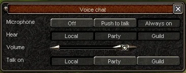

# Voice chat system
Due to unforeseen(but expected) circumstances -such as a very hungry little boy reselling my work- I have decided to make this version public.

### This version's features:
- Proximity chat (local)
- Guild chat (in-map)
- Party chat (in-map)
- Global/Master volume
- Per-speaker volume handling (with the ability to pin speakers at the top of the list)
- Configurable sampling frequency and channels
(I still recommend sticking to 32kHz and 1 channel because of packet sizes.)
- You can not speak over a channel unless hearing is also enabled
- Sound reduction to prevent loud sounds from blasting your ears
- Basic but functional sound detection to avoid unnecessary packets
- FLAC encoding/decoding to reduce packet sizes wherever possible
- ?? Fuck knows, I can't remember.

### Notes:
- M2's networking doesn't handle partial packets.
    - You'll have to either:
        - Disable `IMPROVED_PACKET_ENCRYPTION`, or 
        - Implement that part yourself(I won't help you with this, don't DM me.)

- Don't bother with pull requests, this repo was released out of necessity, it won't receive any updates.
    - If you want to make changes, feel free to fork it.

- The system has been live for over a year on multiple servers and tested by thousands of users.
    - If it doesn't work on your server, you did something wrong.

### QFlags
- `/e voice_chat_disable 1/0` to enable/disable
- `/e voice_chat_hear_yourself 1/0` to be able to hear yourself(only on test_server)

### Technologies used:
- <a href="https://miniaud.io/" target="_blank" rel="noopener noreferrer">Miniaudio - An audio playback and capture library for C and C++</a>
- <a href="https://xiph.org/flac/index.html" target="_blank" rel="noopener noreferrer">FLAC - Free losless audio codec</a>

### Building
If you know how to open the Visual Studio solution, you also know how to build it.
In case you need more info or want to change something:
- Select your preferred configuration(Release/Debug) and Platform(x86/x64)

- The default config is to build as a static library(you'll probably need to add the flac libs to your client's extern as well)

- If you want to use it as a DLL:
	- `right click on core -> Properties -> General -> Set Configuration Type to Dynamic Library`
	- Go to voice_chat.h and comment `#define VOICE_CHAT__STATIC_LIB`
	- Don't foget to replace the includes with the new ones from the project(the ones in public implementation may be older)

- `CTRL + SHIFT + B` to build(or right click on the solution and click `Build Solution`)

- I can't remember, but I think I disabled all symbols for debug builds, you'll have to turn them back on if you need them
	- `right click on core -> Properties-> C/C++ -> General -> Debug Information Format`
	- If you're building it as DLL, you'll also have to: `Properties -> Linker -> Debugging -> Generate Debug Info`

#### Forums/Topics:
- <a href="https://metin2.dev/topic/33630-voice-chat-system/" target="_blank" rel="noopener noreferrer">Metin2Dev</a>
- <a href="https://metin2.forum/post5105.html#p5105" target="_blank" rel="noopener noreferrer">Metin2Forum</a>
- <a href="https://just4metin.ro/viewtopic.php?p=833110#p833110" target="_blank" rel="noopener noreferrer">Just4Metin</a>
- <a href="https://forum.turkmmo.com/konu/3917308-voice-chat-system/" target="_blank" rel="noopener noreferrer">TurkMMO</a>

If you'd like to add your forum here, DM me on discord at `amun3808`

All of my customers will receive an update with more features soon.

This version received its last update on `28.01.2025`

Good luck.
